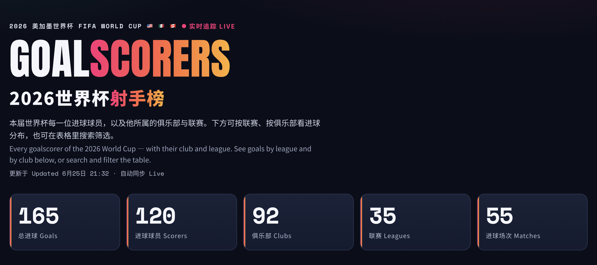
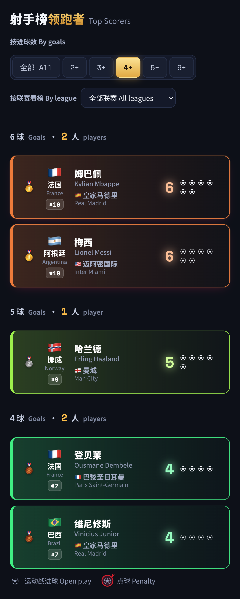
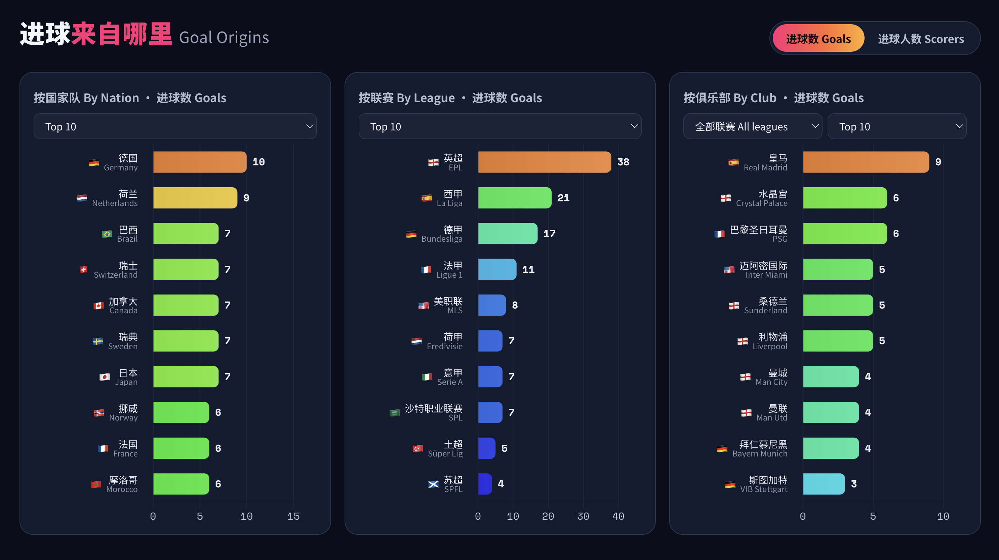
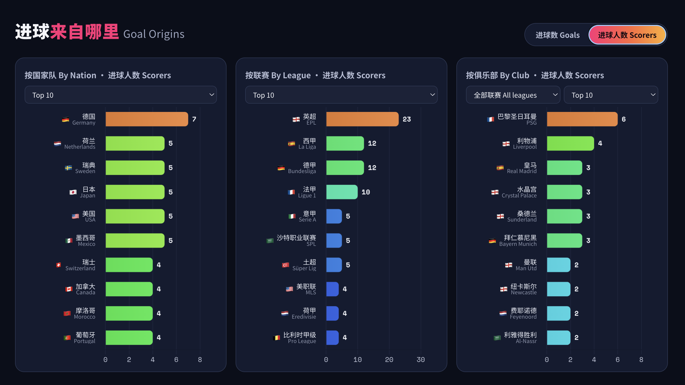
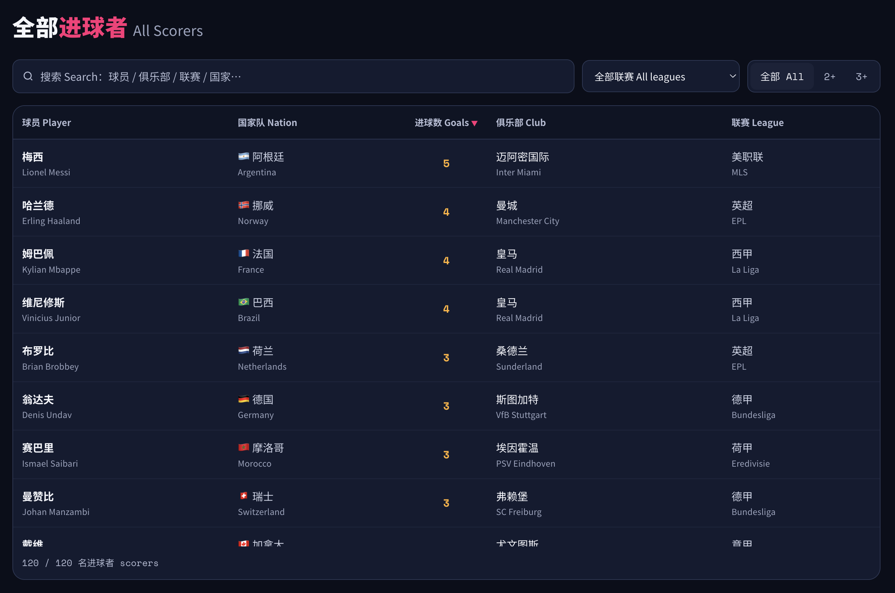
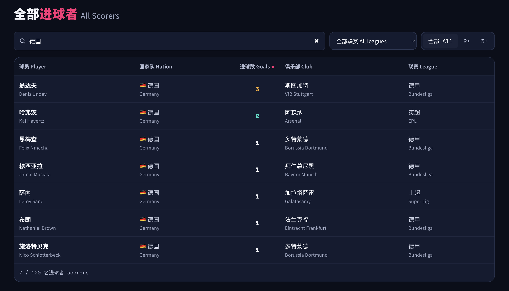
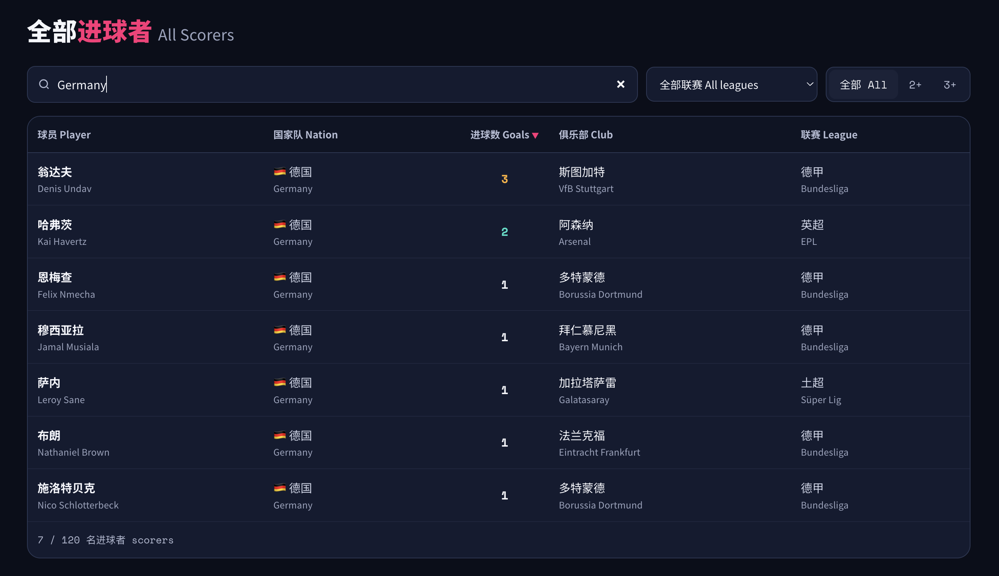
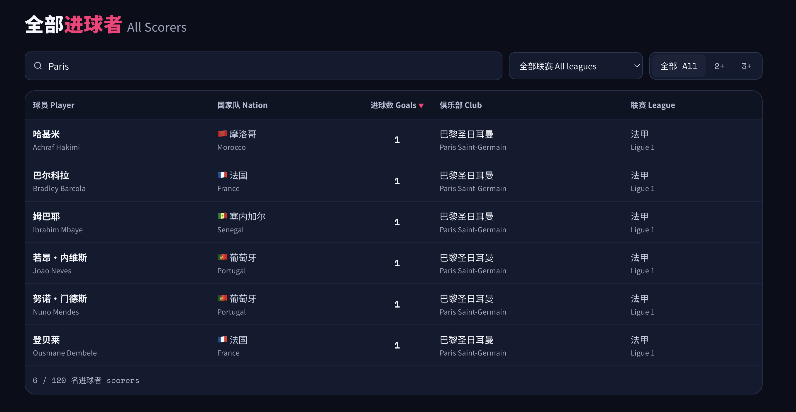
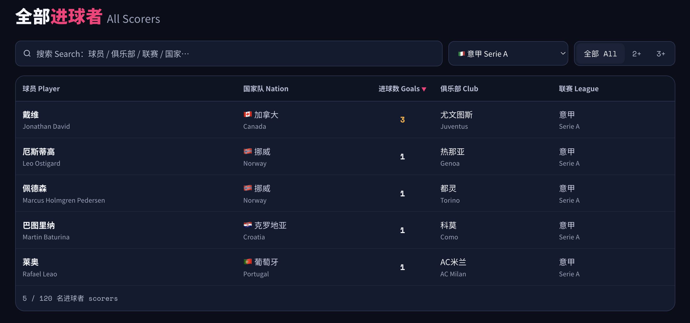
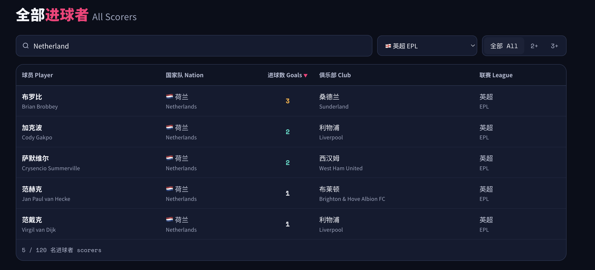

# FIFA-World-Cup-2026-Scorers · 2026 世界杯射手榜

A **bilingual (English / Chinese)** goalscorer dashboard for the 2026 FIFA World Cup. Data updates automatically every day, hosted on GitHub Pages — zero cost, zero maintenance.

一个**中英双语**的 2026 美加墨世界杯（FIFA World Cup 2026）进球榜网站，数据每天自动更新，托管在 GitHub Pages 上，零成本、零维护。

🔗 **Live site / 在线地址**: https://roy2ez.github.io/wc2026-scorers/

---

## Screenshots / 截图

### Hero & stats overview / 顶部与统计概览
At-a-glance totals: goals, scorers, clubs, leagues, and matches with goals. 

一眼掌握总数：总进球、进球球员、俱乐部、联赛、进球场次。



### Top Scorers / 射手榜领跑者
Goal ranking with All / 2+ / 3+ / 4+ / 5+ filters. Each row is auto-colored by its goal tier — the color scale rescales to the current max, so tiers never clash.

进球数排名，可按 全部 / 2+ / 3+ / 4+ / 5+ 筛选。每行按进球档位自动上色，色阶随最高进球数动态调整，进多少球都不撞色。



### Goal Origins — by Goals / 进球来自哪里（进球数口径）
Three charts side by side: by Nation / League / Club. Each has its own Top 10 / 15 / 20 / All selector; the club chart can drill down by league.

三张图并排：按国家队 / 联赛 / 俱乐部。每张图各自可选 Top 10 / 15 / 20 / 全部，俱乐部图还能按联赛下钻。



### Goal Origins — by Scorers / 进球来自哪里（进球人数口径）
One toggle switches all three charts between "Goals" and "Scorers" (number of distinct players).

顶部一键切换，三张图同时在「进球数」与「进球人数」之间切换。



### All Scorers table / 全部进球者总表
The full sortable table — Player / Nation / Goals / Club / League, every column bilingual.

完整可排序表格——球员 / 国家队 / 进球数 / 俱乐部 / 联赛，每列都中英双语。



### Search in either language / 中英文均可搜索
Type in English or Chinese — searching "德国" (Chinese) and "Germany" (English) return the same results, across player / club / league / nation.

中英文都能搜——输入「德国」或「Germany」结果一致，球员 / 俱乐部 / 联赛 / 国家队 全字段匹配。

| 搜「德国」(Chinese) | Search "Germany" (English) |
|:---:|:---:|
|  |  |

### Search by club / 按俱乐部搜索
Searching "Paris" surfaces every Paris Saint-Germain scorer at once.

搜索 "Paris" 即可一次列出所有巴黎圣日耳曼的进球者。



### Filter by league / 按联赛筛选
The league dropdown narrows the table to one competition (e.g. Serie A).

联赛下拉框可把表格筛到单个联赛（如意甲 Serie A）。



### Combine search + filters / 组合搜索与筛选
Search and the league filter stack — e.g. "Netherland" + EPL shows only Dutch scorers playing in the Premier League.

搜索词与联赛筛选可叠加——例如 "Netherland" + 英超，只显示在英超效力的荷兰进球者。



---

## Features

- **Top Scorers** — goal ranking, filterable by All / 2+ / 3+ / 4+ / 5+ goals; each row is auto-colored by its goal tier (the color scale adjusts to the current max, so tiers never clash no matter how high the count goes).
- **Goal Origins** — three bar charts: by **Nation** / by **League** / by **Club**, with a Goals / Scorers toggle, a Top 10 / 15 / 20 / All selector per chart, and league drill-down on the club chart.
- **All Scorers** — a searchable, league-filterable, sortable full table; the Player / Nation / Club / League columns are all bilingual.
- **Stats overview** — total goals, scorers, clubs, leagues, and matches with goals.
- **Fully bilingual**, responsive across phone / tablet / desktop.

## 功能一览

- **射手榜领跑者**：进球数排名，可按 全部 / 2+ / 3+ / 4+ / 5+ 球筛选；每行按进球档位自动上色（色阶随最高进球数动态调整，进多少球都不撞色）。
- **进球来自哪里**：三张柱状图——按国家队 / 按联赛 / 按俱乐部，可切换「进球数 / 进球人数」口径，每张图可选 Top 10 / 15 / 20 / 全部，俱乐部图还能按联赛下钻。
- **全部进球者**：可搜索、可按联赛筛选、可排序的完整表格，球员 / 国家队 / 俱乐部 / 联赛五列均中英双语。
- **统计概览**：总进球、进球球员、俱乐部、联赛、进球场次。
- **全站中英双语**，自适应手机 / 平板 / 电脑。

---

## How auto-update works

```
GitHub Actions (scheduled)  ->  update_data.py fetches data  ->  writes data.json  ->  auto-commit
                                                                       |
                                                                       v
                       index.html reads data.json on load and shows the latest data
```

1. **Data source**: [openfootball/worldcup.json](https://github.com/openfootball/worldcup.json) — public domain, free, no API key, with per-match goalscorers (updated by the author after each match).
2. **Fetch script** `update_data.py`: downloads the JSON, tallies each player's goals (own goals excluded from individuals), resolves club & league, and writes `data.json`.
3. **Scheduled job** `.github/workflows/update.yml`: on match days, runs every 30 minutes between 9:00–23:00 US Pacific (cron uses UTC). Commits only when data changes.
4. **Front end** `index.html`: ships a built-in snapshot for offline/instant display, then fetches `data.json` to overwrite with the latest; the "Updated…" line shows `Live` (latest data loaded) or `Snapshot` (fallback).

> Data freshness depends on how quickly the upstream author logs each match; once a job succeeds, the site syncs within 30 minutes.

## 自动更新是怎么跑的

```
GitHub Actions (定时)  ->  update_data.py 抓取数据  ->  写入 data.json  ->  自动提交
                                                              |
                                                              v
                          网页 index.html 加载时读取 data.json 显示最新数据
```

1. **数据源**：[openfootball/worldcup.json](https://github.com/openfootball/worldcup.json) —— 公共领域、免费、无需 API key，含每场逐个进球者（作者每场赛后更新）。
2. **抓取脚本** `update_data.py`：下载该 JSON，统计每名球员进球数（乌龙球不计入个人），解析所属俱乐部与联赛，写出 `data.json`。
3. **定时任务** `.github/workflows/update.yml`：比赛日美西 9:00–23:00 之间每 30 分钟跑一次（cron 用 UTC）。数据有变化才提交，无变化不提交。
4. **前端** `index.html`：内置一份快照可离线/秒显，加载时再抓取 `data.json` 覆盖为最新；页面顶部「更新于…」结尾会显示 自动同步 Live（已读到最新数据）或 内置快照 Snapshot（兜底）。

> 数据新鲜度取决于上游作者多久录入；任务跑成功后，最多 30 分钟内同步到网站。

---

## File structure

| File | Description |
|---|---|
| `index.html` | The site itself (front end + built-in snapshot + data.json loading) |
| `data.json` | Current goal data, auto-generated by the script |
| `update_data.py` | Script that fetches and generates data.json on each run |
| `club_overrides.json` | Hand-verified player -> club / league / nation table (highest priority) |
| `squad_db.json` | Full squad DB (~1248 players) parsed from official FIFA 26-man lists; auto-fallback for new scorers' clubs |
| `.github/workflows/update.yml` | GitHub Actions schedule config |

**Club resolution priority**: `alias normalization` -> `club_overrides.json` (hand-verified, most accurate) -> `squad_db.json` (full DB, matched by nation+surname) -> blank "—"

## 文件结构

| 文件 | 说明 |
|---|---|
| `index.html` | 网站本体（前端 + 内置快照 + 读取 data.json 逻辑） |
| `data.json` | 当前进球数据，由脚本自动生成 |
| `update_data.py` | 每次运行抓取并生成 data.json 的脚本 |
| `club_overrides.json` | 人工核对的「球员 -> 俱乐部 / 联赛 / 国家队」对照表（最高优先级） |
| `squad_db.json` | 由 FIFA 官方 26 人名单解析的全员库（约 1248 人），新进球者俱乐部自动兜底 |
| `.github/workflows/update.yml` | GitHub Actions 定时任务配置 |

**俱乐部解析优先级**：`别名归一` -> `club_overrides.json`（人工核对，最准）-> `squad_db.json`（全员库，按 国家+姓 匹配）-> 留空「—」

---

## Run it manually

Repo top -> **Actions** -> **Update WC2026 scorers** -> **Run workflow**. After it finishes, the `Fetch latest goals` step prints something like:

```
OK: 120 scorers, 165 goals, 55 matches with goals. Clubs missing: 0.
This run added 3 goal(s):
  + New scorer Daizen Maeda (Japan) 1 goal
  + 1 more goal: Brian Brobbey
```

## 手动跑一次（想立刻更新时）

仓库顶部 Actions -> 左侧 Update WC2026 scorers -> Run workflow。跑完点进运行记录，Fetch latest goals 步骤会打印类似上面的输出。

---

## Data notes

- Goal data sourced from official FIFA match data and post-match reports (compiled via openfootball).
- Club = the player's registered club in their national-team squad.
- Own goals are **not** credited to individuals.

## 数据口径

- 进球数据来源：FIFA 官方比赛数据与赛后报道（经 openfootball 整理）。
- 俱乐部 = 球员在各国 26 人名单中登记的所属球会。
- 乌龙球不计入个人进球。

---

## Tech stack / 技术栈

A pure static site: HTML + vanilla JavaScript + [Chart.js](https://www.chartjs.org/); data pipeline in Python (standard library, no third-party deps); GitHub Actions + GitHub Pages. No backend, no database, no API key.

纯静态站点：HTML + 原生 JavaScript + Chart.js；数据管线 Python（标准库，无第三方依赖）；GitHub Actions + GitHub Pages。无后端、无数据库、无 API key。
