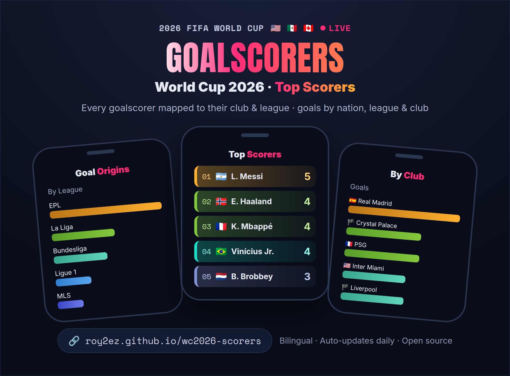
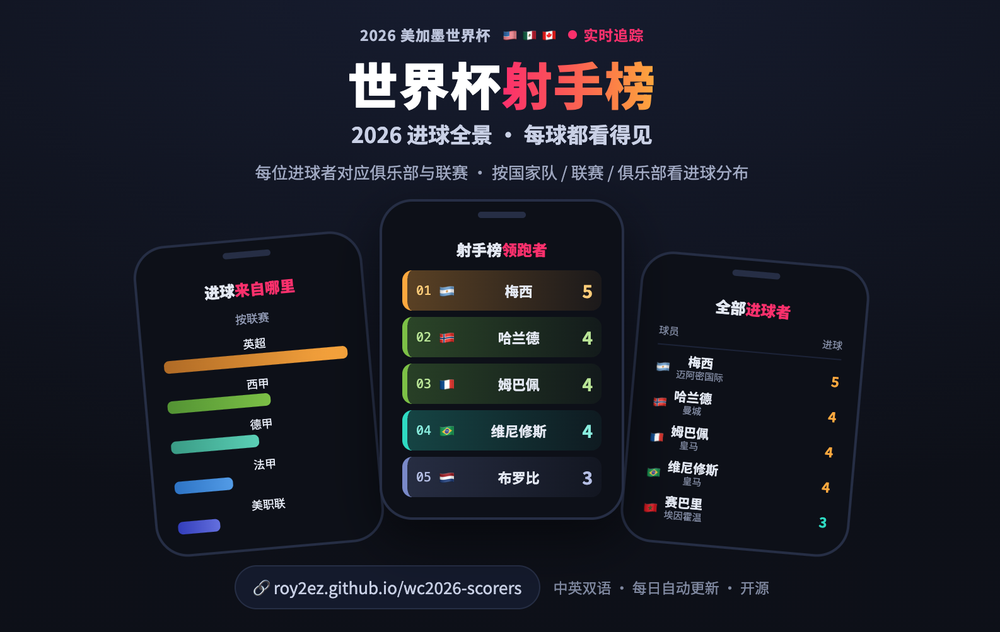

# FIFA-World-Cup-2026-Scorers · 2026 世界杯射手榜

A **bilingual (English / Chinese)** goalscorer dashboard for the 2026 FIFA World Cup, backed by a full **1,248-player database**. Data updates automatically every day, hosted on GitHub Pages — zero cost, zero maintenance.

一个**中英双语**的 2026 美加墨世界杯（FIFA World Cup 2026）进球榜网站，背后是一个**1248 名球员的完整数据库**。数据每天自动更新，托管在 GitHub Pages 上，零成本、零维护。

🔗 **Live site / 在线地址**: https://roy2ez.github.io/wc2026-scorers/





---

## Screenshots / 截图

### Hero & stats overview / 顶部与统计概览
At-a-glance totals: goals, scorers, clubs, leagues, and matches with goals. The header shows whether data is `Live` (synced) or `Snapshot` (fallback).
一眼掌握总数：总进球、进球球员、俱乐部、联赛、进球场次。抬头会显示数据是 `自动同步 Live` 还是 `内置快照 Snapshot`。


### Top Scorers / 射手榜领跑者
Goal ranking with All / 2+ / 3+ / 4+ / 5+ filters. Each row is auto-colored by its goal tier — the color scale rescales to the current max, so tiers never clash.
进球数排名，可按 全部 / 2+ / 3+ / 4+ / 5+ 筛选。每行按进球档位自动上色，色阶随最高进球数动态调整，进多少球都不撞色。


### Goal Origins — by Goals / 进球来自哪里（进球数口径）
Three charts side by side: by Nation / League / Club. Each has its own Top 10 / 15 / 20 / All selector; the club chart can drill down by league.
三张图并排：按国家队 / 联赛 / 俱乐部。每张图各自可选 Top 10 / 15 / 20 / 全部，俱乐部图还能按联赛下钻。


### Goal Origins — by Scorers / 进球来自哪里（进球人数口径）
One toggle switches all three charts between "Goals" and "Scorers" (number of distinct players).
顶部一键切换，三张图同时在「进球数」与「进球人数」之间切换。


### All Players database / 全部球员查询数据库
A complete, searchable database of **all 1,248 players** across 48 teams — Chinese name, English name, squad number, position, nation, club and league for every player, **including those with 0 goals**. Filter by All / 1+ / 2+ / 3+ / 4+ / 5+ goals; sort any column.
覆盖 48 队**全部 1248 名球员**的可查询数据库——每人都有中文名、英文名、号码、位置、国家队、俱乐部、联赛，**包含尚未/没有进球的球员**（进球数记为 0）。可按 全部 / 1+ / 2+ / 3+ / 4+ / 5+ 进球筛选，任意列可排序。


### Search in either language, with autocomplete / 中英文搜索 + 自动补全
Type in English or Chinese — searching "德国" and "Germany" return the same results. As you type, an autocomplete dropdown suggests matching nations, clubs and players; picking one applies an exact filter (so "葡萄牙" the nation won't pull in "葡萄牙体育" the club).
中英文都能搜——输入「德国」或「Germany」结果一致。输入时会弹出自动补全下拉，提示匹配的国家队 / 俱乐部 / 球员；点选某项即精确筛选（所以选「葡萄牙」国家队不会混入「葡萄牙体育」俱乐部）。

| 搜「德国」(Chinese) | Search "Germany" (English) |
|:---:|:---:|
|  |  |

### Search by club / 按俱乐部搜索
Searching "Paris" surfaces every Paris Saint-Germain player at once.
搜索 "Paris" 即可一次列出所有巴黎圣日耳曼的球员。


### Filter by league / 按联赛筛选
The league dropdown narrows the table to one competition (e.g. Serie A).
联赛下拉框可把表格筛到单个联赛（如意甲 Serie A）。


### Combine search + filters / 组合搜索与筛选
Search, league filter and goal filter all stack — e.g. "Netherland" + EPL shows only Dutch players at Premier League clubs.
搜索词、联赛筛选、进球筛选可叠加——例如 "Netherland" + 英超，只显示在英超效力的荷兰球员。


---

## Features

- **Top Scorers** — goal ranking, filterable by All / 2+ / 3+ / 4+ / 5+ goals; each row is auto-colored by its goal tier (the color scale adjusts to the current max, so tiers never clash no matter how high the count goes).
- **Goal Origins** — three bar charts: by **Nation** / by **League** / by **Club**, with a Goals / Scorers toggle, a Top 10 / 15 / 20 / All selector per chart, and league drill-down on the club chart.
- **All Players database** — every one of the **1,248 players** is searchable, with squad number, position, nation, club and league; players with 0 goals are included so you can look up anyone. Searchable, league-filterable, goal-filterable and sortable; all columns bilingual.
- **Search with autocomplete** — works in English and Chinese; a live dropdown suggests nations / clubs / players, and picking a suggestion applies an exact filter.
- **Stats overview** — total goals, scorers, clubs, leagues, and matches with goals.
- **Fully bilingual**, responsive across phone / tablet / desktop. A version tag in the footer (e.g. `v1.4.0 · build … · data …`) makes it easy to confirm the live site is up to date.

## 功能一览

- **射手榜领跑者**：进球数排名，可按 全部 / 2+ / 3+ / 4+ / 5+ 球筛选；每行按进球档位自动上色（色阶随最高进球数动态调整，进多少球都不撞色）。
- **进球来自哪里**：三张柱状图——按国家队 / 按联赛 / 按俱乐部，可切换「进球数 / 进球人数」口径，每张图可选 Top 10 / 15 / 20 / 全部，俱乐部图还能按联赛下钻。
- **全部球员查询数据库**：**1248 名球员**逐一可查，含号码、位置、国家队、俱乐部、联赛；没进球的球员也收录，任意球员都能查到。可搜索、可按联赛筛选、可按进球数筛选、可排序，所有列中英双语。
- **搜索 + 自动补全**：中英文均可；输入时弹出下拉，提示国家队 / 俱乐部 / 球员，点选即精确筛选。
- **统计概览**：总进球、进球球员、俱乐部、联赛、进球场次。
- **全站中英双语**，自适应手机 / 平板 / 电脑。页脚有版本标记（如 `v1.4.0 · build … · data …`），方便确认线上是否为最新版。

---

## Data architecture / 数据架构

The site is built on a **single source of truth**: one master player database with stable IDs. Goal data is attached to players **by ID**, never by guessing names — so a player's number, position, club and Chinese name can never get lost or mismatched.

网站建立在**单一数据源**之上：一个带稳定 ID 的权威球员数据库。进球数据通过 **ID** 精确叠加到球员上，绝不靠"猜名字"——所以球员的号码、位置、俱乐部、中文名不会丢失或错配。

```
players.json (1,248 players, each with a stable id like "BRA-7")
        |
        |  update_data.py  +  scorer_map.json (scorer name -> player id)
        v
openfootball goals  --resolved by id-->  goals added to each player
        |
        v
     data.json  (scorers = players who scored; roster = all 1,248 players)
        |
        v
   index.html  reads data.json and renders everything
```

1. **`players.json`** — the master database. One record per player: `id` (nation-code + shirt number, e.g. `BRA-7`), English name, Chinese name, number, position, nation, club, league. Built once for the tournament from official FIFA squad lists + curated Chinese names.
2. **`scorer_map.json`** — a verified map from each goalscorer's name (as it appears upstream) to a player `id`. Resolved once and locked in, so the same player is never mismatched again (this is what fixed earlier issues like duplicate names or a forward matched to a goalkeeper).
3. **`update_data.py`** — fetches goals, resolves each scorer to an `id` (via the map; case/accent-insensitive, with a conservative fuzzy fallback for brand-new names), tallies goals by `id`, and writes `data.json`. Any name it can't resolve is logged so it can be added to the map.
4. **`index.html`** — reads `data.json` and renders the dashboard; Chinese names come straight from the database (`nameZh`).

1. **`players.json`**：权威数据库。每名球员一条记录：`id`（国家码 + 球衣号，如 `BRA-7`）、英文名、中文名、号码、位置、国家队、俱乐部、联赛。整届赛事构建一次，数据来自 FIFA 官方名单 + 人工校对的中文名。
2. **`scorer_map.json`**：进球者名（上游写法）→ 球员 `id` 的验证映射。解析一次后锁定，同一球员不会再错配（之前"同名撞车""前锋被配成门将"等问题就是靠它根治的）。
3. **`update_data.py`**：抓取进球，把每个进球者解析成 `id`（走映射表，大小写/音标无关，新球员有保守的兜底匹配），按 `id` 累加进球，写出 `data.json`。解析不了的名字会打印到日志，便于加进映射表。
4. **`index.html`**：读取 `data.json` 渲染页面；中文名直接取自数据库（`nameZh`）。

---

## How auto-update works

```
GitHub Actions (scheduled)  ->  update_data.py fetches goals  ->  writes data.json  ->  auto-commit
                                                                       |
                                                                       v
                       index.html reads data.json on load and shows the latest data
```

1. **Goal source**: [openfootball/worldcup.json](https://github.com/openfootball/worldcup.json) — public domain, free, no API key, with per-match goalscorers (updated by the author after each match).
2. **Player database**: `players.json`, built from the official FIFA 26-man squad lists (1,248 players).
3. **Fetch script** `update_data.py`: downloads the goal JSON, resolves each scorer to a player id, tallies goals (own goals excluded from individuals), and writes `data.json`.
4. **Scheduled job** `.github/workflows/update.yml`: on match days, runs every 30 minutes between 9:00–23:00 US Pacific (cron uses UTC). Commits only when data changes.
5. **Front end** `index.html`: ships a built-in snapshot for offline/instant display, then fetches `data.json` to overwrite with the latest; the "Updated…" line shows `Live` or `Snapshot`.

> Data freshness depends on how quickly the upstream author logs each match; once a job succeeds, the site syncs within 30 minutes.

## 自动更新是怎么跑的

```
GitHub Actions (定时)  ->  update_data.py 抓取进球  ->  写入 data.json  ->  自动提交
                                                              |
                                                              v
                          网页 index.html 加载时读取 data.json 显示最新数据
```

1. **进球来源**：[openfootball/worldcup.json](https://github.com/openfootball/worldcup.json) —— 公共领域、免费、无需 API key，含每场逐个进球者（作者每场赛后更新）。
2. **球员数据库**：`players.json`，由 FIFA 官方 26 人名单构建（1248 人）。
3. **抓取脚本** `update_data.py`：下载进球 JSON，把每个进球者解析成球员 id，统计进球数（乌龙球不计入个人），写出 `data.json`。
4. **定时任务** `.github/workflows/update.yml`：比赛日美西 9:00–23:00 之间每 30 分钟跑一次（cron 用 UTC）。数据有变化才提交，无变化不提交。
5. **前端** `index.html`：内置一份快照可离线/秒显，加载时再抓取 `data.json` 覆盖为最新；页面顶部「更新于…」结尾会显示 自动同步 Live 或 内置快照 Snapshot。

> 数据新鲜度取决于上游作者多久录入；任务跑成功后，最多 30 分钟内同步到网站。

---

## File structure

**Active — used by the live pipeline:**

| File | Description |
|---|---|
| `index.html` | The site itself (front end + built-in snapshot + data.json loading) |
| `players.json` | **Master player database** — all 1,248 players, each with a stable id, Chinese & English name, number, position, nation, club, league |
| `scorer_map.json` | Verified map from goalscorer name → player id (resolved once, locked in) |
| `data.json` | Current data, auto-generated each run (`scorers` = players who scored; `roster` = all players) |
| `update_data.py` | Script that fetches goals and generates data.json, attaching goals by player id |
| `.github/workflows/` | GitHub Actions schedule config (the update workflow) |
| `screenshots/` | Images used in this README |

**Legacy — kept for reference, no longer read by the pipeline (as of v1.4.0):**

| File | Was used for |
|---|---|
| `roster.json` | Earlier all-players list, now superseded by `players.json` |
| `names_zh.json` | Earlier standalone Chinese-name map, now merged into `players.json` (`nameZh`) |
| `club_overrides.json` | Hand-verified club/league/nation corrections, now baked into `players.json` |
| `squad_db.json` | Squad DB parsed from FIFA lists, used to build `players.json` |

> These four were how older builds resolved clubs and names at runtime. From v1.4.0 everything is consolidated into `players.json` (the single source of truth). They're safe to keep (handy if you ever rebuild `players.json`) or to delete — the site and the daily job don't load them.

## 文件结构

**在用——线上管线依赖：**

| 文件 | 说明 |
|---|---|
| `index.html` | 网站本体（前端 + 内置快照 + 读取 data.json 逻辑） |
| `players.json` | **权威球员数据库**——全部 1248 人，每人含稳定 id、中英文名、号码、位置、国家队、俱乐部、联赛 |
| `scorer_map.json` | 进球者名 → 球员 id 的验证映射（解析一次，锁定） |
| `data.json` | 当前数据，每次运行自动生成（`scorers` = 有进球的球员；`roster` = 全员） |
| `update_data.py` | 抓取进球并生成 data.json 的脚本，按球员 id 叠加进球 |
| `.github/workflows/` | GitHub Actions 定时任务配置（更新工作流） |
| `screenshots/` | 本 README 用到的图片 |

**历史保留——仓库中仍在，但管线已不再读取（自 v1.4.0 起）：**

| 文件 | 曾经的用途 |
|---|---|
| `roster.json` | 早期的全员名单，已被 `players.json` 取代 |
| `names_zh.json` | 早期独立的中文名映射，已并入 `players.json`（`nameZh` 字段） |
| `club_overrides.json` | 人工核对的俱乐部/联赛/国家校正，已写入 `players.json` |
| `squad_db.json` | 由 FIFA 名单解析的全员库，用于构建 `players.json` |

> 这四个文件是旧版在运行时解析俱乐部和译名的方式。自 v1.4.0 起，全部合并进 `players.json`（单一数据源）。它们留着也行（将来若要重建 `players.json` 会用到）、删掉也行——网站和每日任务都不会读取它们。

---

## Update the result manually

Repo top -> **Actions** -> **Update WC2026 scorers** -> **Run workflow**. After it finishes, the `Fetch latest goals` step prints something like:

```
OK: 125 scorers, 175 goals, 57 matches with goals.
This run added 3 goal(s):
  + New scorer Daizen Maeda (Japan) 1 goal
  + 1 more goal: Brian Brobbey
```

If a brand-new scorer's name can't be matched automatically, the log shows a `WARNING: unresolved scorer name(s)` line — add that name to `scorer_map.json` (one line: `"Name": "player-id"`) and it's fixed for good.

## 手动跑一次数据更新（想立刻更新时）

仓库顶部 Actions -> 左侧 Update WC2026 scorers -> Run workflow。跑完点进运行记录，`Fetch latest goals` 步骤会打印类似上面的输出。

若某个全新进球者无法自动匹配，日志会出现 `WARNING: unresolved scorer name(s)` —— 把该名字加进 `scorer_map.json`（一行：`"名字": "球员id"`）即可永久修复。

---

## Data notes

- Goal data sourced from official FIFA match data and post-match reports (compiled via openfootball).
- Club = the player's registered club in their national-team squad.
- Own goals are **not** credited to individuals.

## 数据口径

- 进球数据来源：FIFA 官方比赛数据与赛后报道（经 openfootball 整理）。
- 俱乐部 = 球员在各国 26 人名单中登记的所属球会。
- 乌龙球不计入个人进球。

---

## Tech stack / 技术栈

A pure static site: HTML + vanilla JavaScript + [Chart.js](https://www.chartjs.org/); data pipeline in Python (standard library, no third-party deps); GitHub Actions + GitHub Pages. No backend, no database, no API key.

纯静态站点：HTML + 原生 JavaScript + Chart.js；数据管线 Python（标准库，无第三方依赖）；GitHub Actions + GitHub Pages。无后端、无数据库、无 API key。
