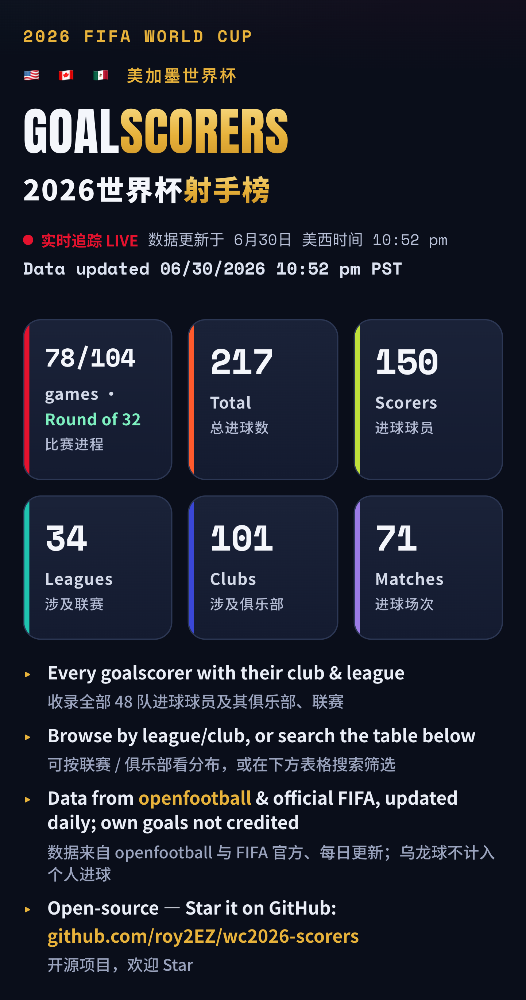
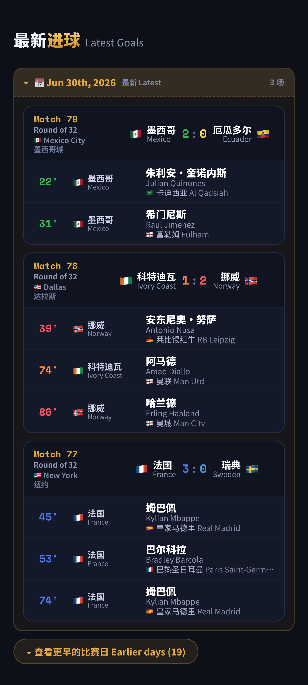
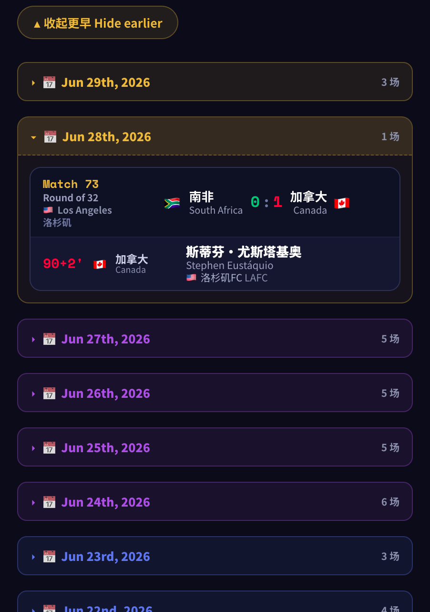
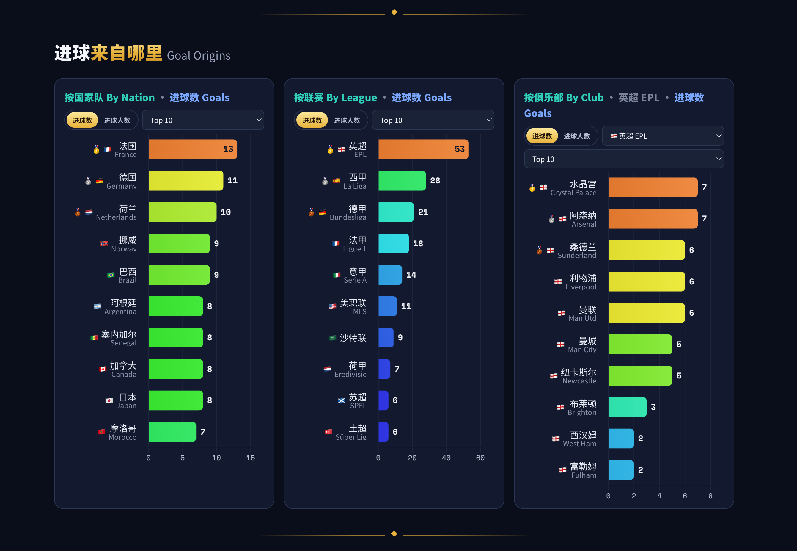
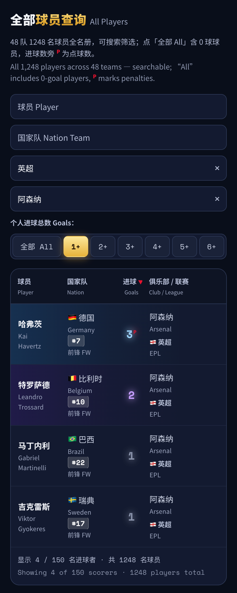
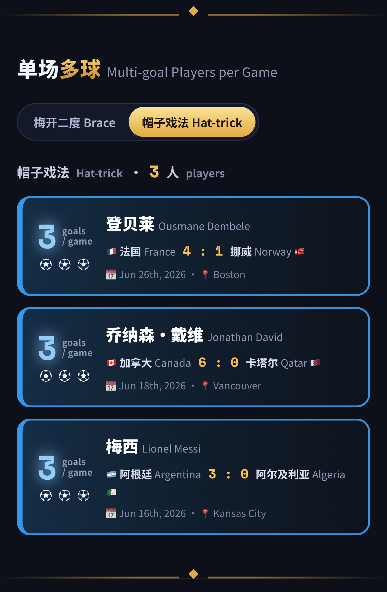
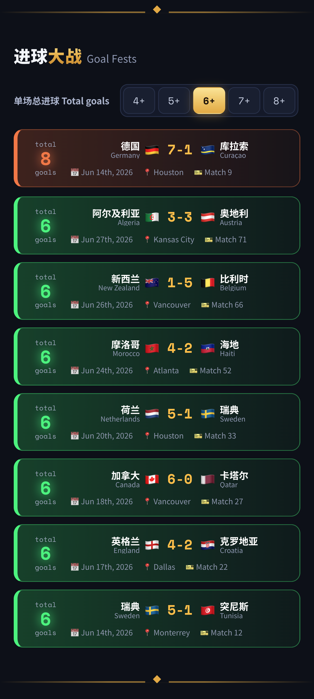
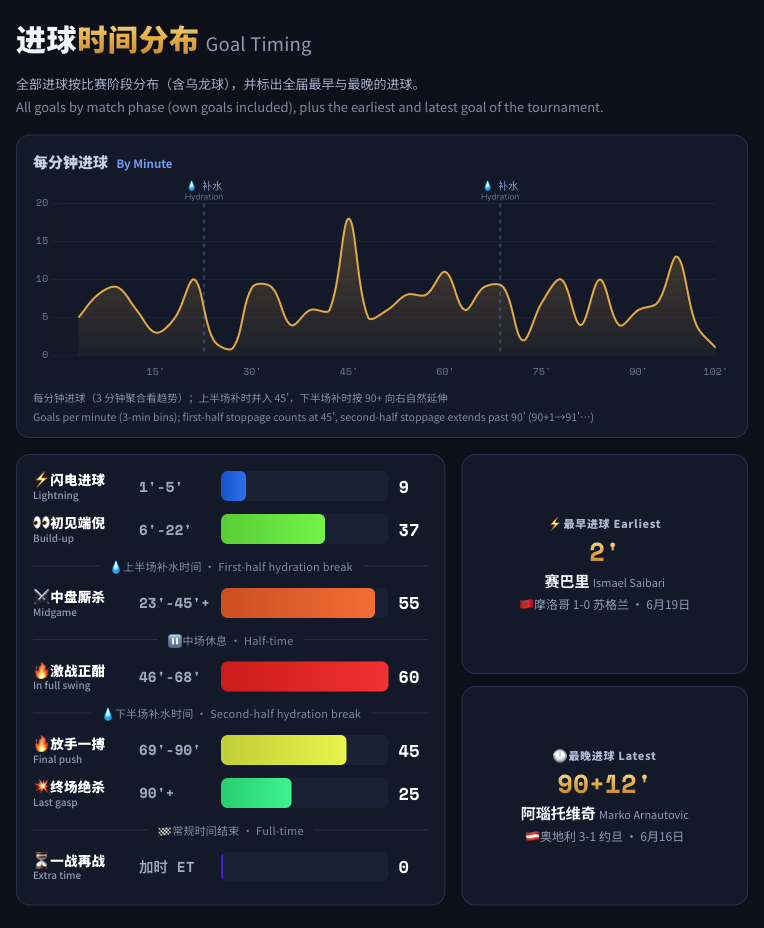

# FIFA World Cup 2026 Scorers · 2026 世界杯射手榜

A **bilingual (English / Chinese)** goalscorer dashboard for the 2026 FIFA World Cup, backed by a full **1,248-player database**. Updates daily, hosted free on GitHub Pages.

**中英双语**的 2026 美加墨世界杯进球榜，背后是 **1248 名球员的完整数据库**，每日自动更新、托管在 GitHub Pages，零成本。

🔗 **Live / 在线**: https://roy2ez.github.io/wc2026-scorers/


---

## Screenshots / 截图

| Screenshot / 截图 | Feature / 功能 |
|---|---|
|  | **Hero & stats · 页头与统计**<br>Title with six live stat cards: matches played, goals, scorers, leagues, clubs, matches-with-goals.<br>标题 + 六张实时统计卡（比赛进程/总进球/进球者/联赛/俱乐部/场次）。 |
|  | **Latest Goals · 最新进球**<br>Every goal grouped by match, newest first — Match #, round & group, two-color scoreline, host city, penalty shootout, scorer + club.<br>全部进球按比赛分组、最新在前——Match 编号、轮次与小组、两色比分、主办城市、点球大战、进球者+俱乐部。 |
|  | **Latest Goals · earlier days / 按天折叠**<br>Earlier days fold into per-day panels colored by stage (group 1/2/3 = teal/blue/purple, knockouts = gold→red).<br>更早的比赛按天折叠、按阶段着色（小组 1/2/3 = 青/蓝/紫，淘汰赛 = 金→红）。 |
|  | **Top Scorers · 射手榜领跑者**<br>Goal ranking grouped by goal count; tier-colored cards with jersey number and penalty marks.<br>进球数排名、按进球数分组；档位配色，含号码徽章与点球标记。 |
|  | **Goal Origins · 进球来自哪里**<br>Three charts — Nation / League / Club — with a Goals ↔ Scorers toggle.<br>三张图（国家队 / 联赛 / 俱乐部），可切换进球数 / 进球人数。 |
|  | **All Players · 全部球员查询**<br>Searchable database of all 1,248 players (incl. 0-goal), four stacking comboboxes.<br>可查询全部 1248 名球员（含 0 球），四个可叠加的搜索下拉。 |
|  | **Multi-goal · 单场多球**<br>Braces and hat-tricks per match, with match, scoreline, date and venue.<br>单场梅开二度/帽子戏法，附比赛、比分、日期与场地。 |
|  | **Goal Fests · 进球大战**<br>The highest-scoring single matches (4+/5+/6+/7+).<br>单场总进球最多的比赛（4+/5+/6+/7+）。 |
|  | **Goal Timing · 进球时间分布**<br>Goals by match phase, a per-minute line (with hydration markers), plus earliest & latest goal.<br>进球按阶段分布、每分钟折线（含补水标记），并标出最早/最晚进球。 |

---

## Features / 功能

- **Latest Goals / 最新进球** — every goal grouped by match, newest first; days fold into stage-colored panels, with two-color scorelines and penalty-shootout results. 全部进球按比赛分组、最新在前；按天折叠、按阶段着色，两色比分与点球大战结果。
- **Top Scorers / 射手榜领跑者** — goal ranking grouped by goal count; tier-colored cards with jersey number and penalty marks. 进球数排名、按进球数分组；档位配色，含号码与点球标记。
- **Goal Origins / 进球来自哪里** — three charts by Nation / League / Club, with a Goals ↔ Scorers toggle. 三张图（国家队 / 联赛 / 俱乐部），可切换进球数 / 进球人数。
- **All Players / 全部球员查询** — searchable database of all 1,248 players (incl. 0-goal), with four stacking comboboxes. 可查询全部 1248 名球员（含 0 球），四个可叠加的搜索下拉。
- **Multi-goal & Goal Fests / 单场多球 & 进球大战** — braces and hat-tricks per match, and the highest-scoring matches. 单场梅开二度/帽子戏法，以及单场进球最多的比赛。
- **Goal Timing / 进球时间分布** — goals by match phase, a per-minute line, plus the earliest and latest goal. 进球按阶段分布、每分钟折线，并标出最早/最晚进球。

Fully bilingual and responsive (phone / tablet / desktop).
全站双语、自适应手机 / 平板 / 电脑。

---

## Data architecture / 数据架构

**Single source of truth**: a master player database with stable IDs. Goals attach to players **by ID**, never by guessing names — so number, position, club and Chinese name never get lost or mismatched. Match results come from two feeds merged into one: **OpenFootball** (record) with **ESPN** filling any match it hasn't logged yet.

**单一数据源**：带稳定 ID 的球员主表。进球按 **ID** 精确叠加、绝不猜名字，号码/位置/俱乐部/中文名不会错配。比赛结果由两个源合并：**openfootball（记录源）为主**，**ESPN 补齐它还没录入的场次**。

```
players.json + clubs.json + nations.json + scorer_map.json
        │  update_data.py
        │    ├─ openfootball (primary)  +  ESPN (fills missing matches)
        │    └─ resolve scorers → tally by id → fun-stats
        ▼
     data.json  (scorers + roster + funstats)
        │
        ▼
   index.html  renders everything (loading / failed states, no stale snapshot)
```

Team names from any source are normalized to one canonical key; scorer names resolve to player IDs accent-insensitively (unresolved names are logged and pinned in `scorer_map.json`).
任何源的队名都归一化到统一键；进球者名以重音无关方式解析到球员 ID（解析不了的会打日志、锚定进 `scorer_map.json`）。

---

## Auto-update / 自动更新

- **Sources / 来源**: [openfootball/worldcup.json](https://github.com/openfootball/worldcup.json) (public domain, primary) + ESPN's public scoreboard/summary API (auxiliary, fills matches openfootball hasn't logged). openfootball 为主，ESPN 辅助补齐。
- **Schedule / 定时**: GitHub Actions runs `update_data.py` daily and commits only when data changes; can also be run manually (**Actions → Update WC2026 scorers → Run workflow**). 每天跑一次，有变化才提交，也可手动运行。
- **Resilient / 容错**: if ESPN is unavailable the run falls back to openfootball only. If a new scorer can't be matched, the log prints `WARNING: unresolved scorer` — add a line to `scorer_map.json`. ESPN 不可用时自动退回纯 openfootball；新进球者无法匹配时按日志补一行映射。
- **After the tournament / 赛事结束后**: once totals are confirmed against FIFA's official data, the scheduled job is disabled (manual run kept). 与 FIFA 官方核对一致后停用定时任务。

---

## File structure / 文件结构

| File | Description / 说明 |
|---|---|
| `index.html` | The site — front end + data loading (loading/failed states) / 网站本体 |
| `players.json` | Player master table (1,248) / 球员主表 |
| `clubs.json` · `nations.json` | Club & nation master tables / 俱乐部、国家主表 |
| `scorer_map.json` | Scorer name → player id map / 进球者名→id 映射 |
| `update_data.py` | Fetches goals (openfootball + ESPN), generates `data.json` / 抓取并生成数据 |
| `validate_db.py` | Build-time consistency check / 一致性校验 |
| `data.json` | Generated data (`scorers` + `roster` + `funstats`) / 数据产物 |
| `VERSION` | Single source of the version number / 版本号来源 |
| `.github/workflows/` | Scheduled update workflow / 定时任务 |

---

## Notes / 数据口径

- Match results from openfootball (record) and ESPN (fills gaps). 比赛结果来自 openfootball（记录源）与 ESPN（补齐）。
- Club = the player's registered club in their squad. 俱乐部 = 球员国家队名单登记的球会。
- Own goals are **not** credited to individuals (still counted in timing). 乌龙球不计入个人进球（但计入时间分布）。

## Tech stack / 技术栈

Pure static site: HTML + vanilla JS + [Chart.js](https://www.chartjs.org/); Python data pipeline (stdlib only); GitHub Actions + Pages. No backend, no database, no API key.
纯静态：HTML + 原生 JS + Chart.js；Python 数据管线（仅标准库）；GitHub Actions + Pages。无后端、无数据库、无 API key。
